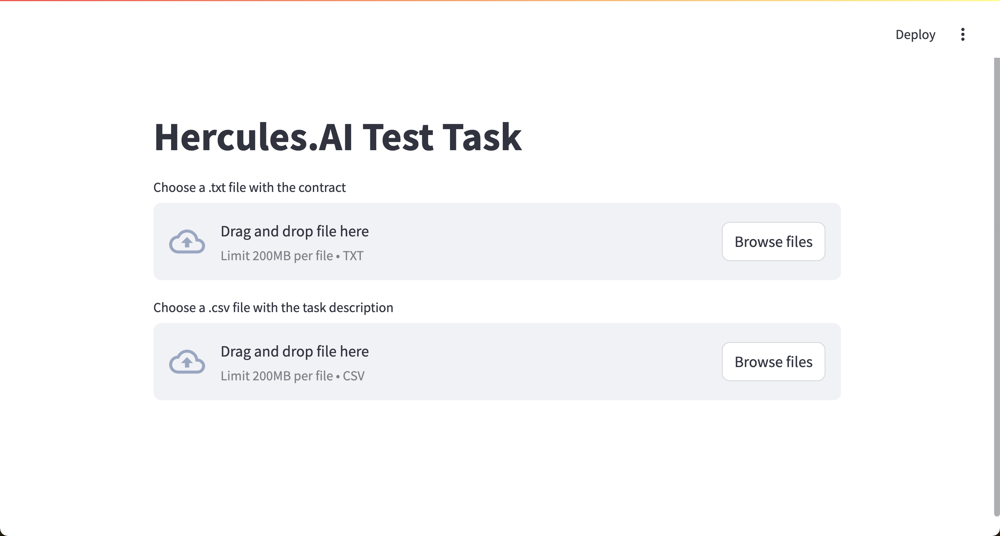
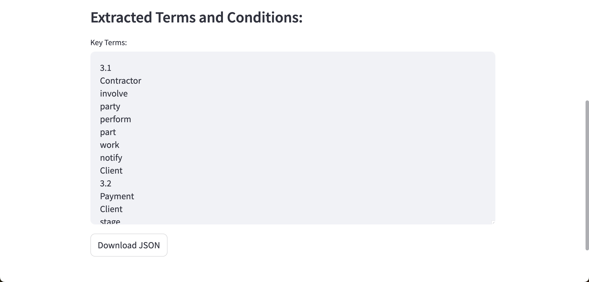
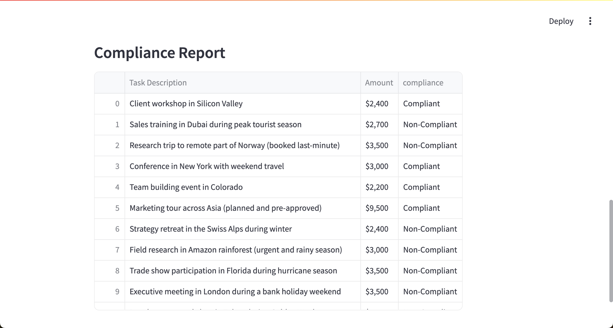
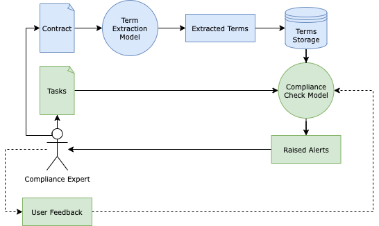

## Installation

Clone the repository:

```
git clone https://github.com/bakarov/llm.git
```

Navigate to the `llm` directory. Install the dependencies:

```
pip install -r requirements.txt
```

Download the Spacy model:

```
python -m spacy download en_core_web_sm
```

Run the tests:

```
python -m unittest test_example.py
```

Run the app:

```
streamlit run app.py
```

## Interface

The interface looks like this:



The user is supposed to upload the contract file in a .txt format. Dealing with a .docx file in a prototype might lead to dependency conflicts and potential vendor locks, so for simplicity I'm focusing on plaintext data.

After the contract file is processed, the interface outputs a list of the extracted terms and conditions. The user can download a .json file with the output. Due to the computational resources limitations, I use baseline language models which cannot always correctly deal with dividing the document into different sections and subsections, therefore I generalize the output for the whole document. Document sectioning could be later implemented through regular expressions if the format of section/subsection marking is known.



At last, once the user uploads the .csv file with task descriptions (just like mentioned above, I use a more generic .csv format instead of a proprietary Excel file), the interface outputs a report on compliance violations. 



Hovering the cursor over the table opens the interface icon for sorting, scaling, and downloading the report data.


## Implementation Details

The provided code addresses the two main components of the technical task: extracting key terms from the contract and analyzing task descriptions for compliance with these extracted terms.



Given that the task description explicitly separates these two logic components, I assume a separation of the data flow in these two cases. The diagram highlights large-scale data analysis with a blue color, while real-time data processing has a green color. Considering that fine-tuning of LLMs is usually computationally expensive, it would make sense to use LLM for a high-scale data processing (extracting key terms), and use a more computationally effective model in the case of a real-time inference (raising compliance alerts). Such architecture will also allow us to implement a feedback loop for continuous training and improvement of the compliance alert model.

In other words, the implementation hinges on the idea of efficiently handling multiple queries of task descriptions given already extracted contract's key terms and conditions. This extraction is a one-time process for a given contract. LLM for the extraction can be fine-tuned to the specific domain to enhance its accuracy and relevance, ensuring that the terms and conditions are well-aligned with the domain-specific language and nuances. In the current implementation, I use T5-small, whose choice was primarily driven by its efficiency and reduced computational requirements. While it remains a strong baseline, it might require additional tuning of hyperparameters or domain-specific fine-tuning using external data sources; in a production setting it could be replaced with larger models like T5-large, LlaMa, Mistral, Claude, or Gemini. Given a Kubernetes cluster, we could orchestrate the model's inference with other components of this general large-scale ETL pipeline (Spark for data processing, S3 buckets or RDS instances for storing raw data, PostgreSQL for storing extracted key terms and other metadata, AirFlow for orchestration and scheduling).

Task description analysis could be understood as a user-facing component that will provide API endpoints for interacting with the compliance expert who reviews the raised alerts. While different supervision constraints could be considered (supervised learning, unsupervised learning, weak labeling, etc), I'd assume the generic case of semi-supervised learning where we don't have initial labels but still can integrate them into the overall pipeline through the feedback loop. I propose to solve the task of aligning task descriptions with the contract's key terms through the methodology of zero-shot learning, which relies on projecting the data samples into the embedding space, representing both task descriptions and categories. Thus, the model can not only generalize to unseen categories but operate with different domains, modalities, and languages (with the help of state-of-the-art embedding models like Multilingual SBERT, AOBERT, Legal-BERT, etc). In the illustrative implementation of this component, I use BERT-base-uncased to embed both the extracted contract terms and the task descriptions and further employ cosine similarity to determine the compliance of each task description with the contract terms. Using BERT-base-uncased in this case is justified, once again, by its computational efficiency, as it has been proven as a strong baseline model for many standard NLP tasks. In production scenarios, the performance of the system here can also be improved by adjusting the model's parameters or using a different type of pre-processing (in this task I use a standard pipeline of n-grams lemmatization). Considering that the model training or fine-tuning can be re-iterated, as well as distributed for different types of contracts we process on the first step, we might also employ the model management and versioning tools (MLFLow, DVC, SageMaker), configuration management tools (Consul), deployment automation tools (Jenkins, Gitlab CI), model serving tools (TorchServe), monitoring tools (Prometheus) and potentially a semantic search index like Elasticsearch to optimize model querying time for the inputs that could match the already labeled task descriptions. For future development, we can ideate the optimization of the computational cost and efficiency by employing model distillation, implementing efficient batch processing, and optimizing the model serialization process for the target deployment environment. Given the challenges with LLM interpretability and the overall black-box nature of these models (especially compared to more straightforward tools like Logistic Regression or Nearest Neighbour Search), we can also incorporate tools like Langfuse (for better prompt management and monitoring), LangChain (for integrating the model with other data sources and APIs), and AutoGen (for employing multiple agents to adapt to various domains simultaneously).